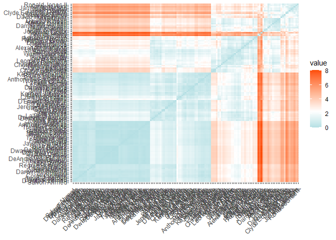
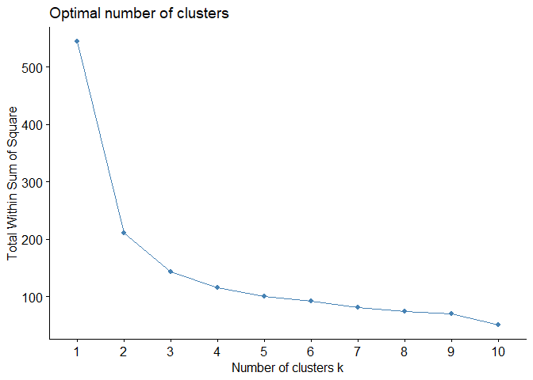
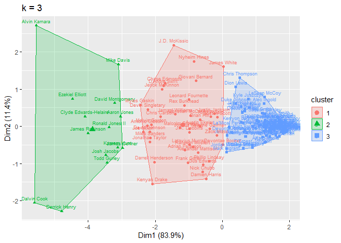

Cluster Analysis
================

# Cluster

``` r
library(tidyverse)
```

    ## -- Attaching packages ---------------------------------------------------------- tidyverse 1.3.0 --

    ## v ggplot2 3.3.2     v purrr   0.3.4
    ## v tibble  3.0.3     v dplyr   1.0.2
    ## v tidyr   1.1.2     v stringr 1.4.0
    ## v readr   1.3.1     v forcats 0.5.0

    ## -- Conflicts ------------------------------------------------------------- tidyverse_conflicts() --
    ## x dplyr::filter() masks stats::filter()
    ## x dplyr::lag()    masks stats::lag()

``` r
library(readr)
library(janitor)
```

    ## 
    ## Attaching package: 'janitor'

    ## The following objects are masked from 'package:stats':
    ## 
    ##     chisq.test, fisher.test

``` r
library(factoextra)
```

    ## Welcome! Want to learn more? See two factoextra-related books at https://goo.gl/ve3WBa

``` r
library(stats)
ff_data <- read_csv("data/ff_2020.csv")
```

    ## Parsed with column specification:
    ## cols(
    ##   .default = col_double(),
    ##   player_name = col_character(),
    ##   fant_pos = col_character(),
    ##   pos = col_character()
    ## )

    ## See spec(...) for full column specifications.

``` r
ff_data <- as.data.frame(ff_data)

row.names(ff_data) <- ff_data$player_name
```

## Scale Data

``` r
ff_scale <- ff_data %>%
  select(tgt, yac, ybc, ppr)

ff_scale <- scale(ff_scale)
ff_scale <- na.omit(ff_scale)
```

``` r
distance <- get_dist(ff_scale)
fviz_dist(distance, gradient = list(low = "#00AFBB", mid = "white", high = "#FC4E07"))
```

<!-- -->

# Determining Optimal Clusters

## Elbow method

``` r
fviz_nbclust(ff_scale, kmeans, method = "wss")
```

<!-- -->

From the elbow method, it looks like k=3 will be the optimal value.

``` r
final <- kmeans(ff_scale, centers = 3, nstart = 25)
finalplot <- fviz_cluster(final, data = ff_scale, labelsize = 7) + ggtitle("k = 3") 
finalplot
```

<!-- -->

# Run algorithm

``` r
# compute k-means with k=2
set.seed(1234)
k3 <- kmeans(ff_scale, centers = 3, nstart = 25)

# Print the results
print(k3)
```

    ## K-means clustering with 3 clusters of sizes 80, 41, 16
    ## 
    ## Cluster means:
    ##          tgt        yac        ybc        ppr
    ## 1 -0.5900941 -0.6169226 -0.6714949 -0.6818283
    ## 2  0.5141999  0.3899089  0.7231828  0.5630249
    ## 3  1.6896862  2.1401595  1.5729420  1.9663904
    ## 
    ## Clustering vector:
    ##           Dalvin Cook          Alvin Kamara         Derrick Henry 
    ##                     3                     3                     3 
    ##        James Robinson           Todd Gurley       Ezekiel Elliott 
    ##                     3                     3                     3 
    ##           Kareem Hunt           Josh Jacobs           Aaron Jones 
    ##                     3                     3                     3 
    ## Clyde Edwards-Helaire          James Conner       Ronald Jones II 
    ##                     3                     3                     3 
    ##            Mike Davis        Antonio Gibson          Chris Carson 
    ##                     3                     2                     2 
    ##     Darrell Henderson       Jonathan Taylor      David Montgomery 
    ##                     2                     2                     3 
    ##       Jerick McKinnon         David Johnson             Joe Mixon 
    ##                     2                     2                     2 
    ##          Kenyan Drake         D'Andre Swift   Christian McCaffrey 
    ##                     2                     2                     2 
    ##         Melvin Gordon          Myles Gaskin         Miles Sanders 
    ##                     2                     3                     2 
    ##         Chase Edmonds      Devin Singletary          Rex Burkhead 
    ##                     2                     3                     2 
    ##       Jamaal Williams       Giovani Bernard         Malcolm Brown 
    ##                     2                     2                     2 
    ##            Nick Chubb          Nyheim Hines        Raheem Mostert 
    ##                     2                     2                     2 
    ##       Latavius Murray       Adrian Peterson           Jeff Wilson 
    ##                     2                     2                     1 
    ##             Zack Moss          J.K. Dobbins           Gus Edwards 
    ##                     2                     2                     2 
    ##     Leonard Fournette         Wayne Gallman         Austin Ekeler 
    ##                     2                     2                     2 
    ##         Joshua Kelley         Damien Harris    Alexander Mattison 
    ##                     2                     2                     2 
    ##            Frank Gore         J.D. McKissic            Brian Hill 
    ##                     2                     2                     2 
    ##       Phillip Lindsay           Mark Ingram          Boston Scott 
    ##                     2                     2                     2 
    ##        Jordan Wilkins       Devontae Booker          Tony Pollard 
    ##                     1                     2                     2 
    ##         DeeJay Dallas        Justin Jackson       Kerryon Johnson 
    ##                     1                     2                     1 
    ##       Devonta Freeman           Carlos Hyde       La'Mical Perine 
    ##                     1                     1                     1 
    ##         Jordan Howard         Kyle Juszczyk       Benny Snell Jr. 
    ##                     1                     1                     1 
    ##           Sony Michel            Dion Lewis           James White 
    ##                     1                     1                     2 
    ##          Duke Johnson         Jamycal Hasty         Jalen Richard 
    ##                     1                     1                     1 
    ##        Chris Thompson         Kalen Ballage          Travis Homer 
    ##                     1                     1                     1 
    ##       Darrel Williams         Peyton Barber           Matt Breida 
    ##                     1                     1                     1 
    ##          Le'Veon Bell             Cam Akers      Jeremy McNichols 
    ##                     1                     1                     1 
    ##           Alec Ingold       Reggie Bonnafon           Tyler Ervin 
    ##                     1                     1                     1 
    ##      D'Ernest Johnson           T.J. Yeldon           Gabe Nabers 
    ##                     1                     1                     1 
    ##         Royce Freeman           Tarik Cohen             AJ Dillon 
    ##                     1                     1                     1 
    ##       Ke'Shawn Vaughn         Alfred Morris         Samaje Perine 
    ##                     1                     1                     1 
    ##        Troymaine Pope        Ameer Abdullah        Saquon Barkley 
    ##                     1                     1                     1 
    ## Anthony McFarland Jr.            Josh Adams         Corey Clement 
    ##                     1                     1                     1 
    ##         Tevin Coleman             Ito Smith       Anthony Sherman 
    ##                     1                     1                     1 
    ##           J.J. Taylor            Ty Johnson           Marlon Mack 
    ##                     1                     1                     1 
    ##          LeSean McCoy        Patrick Ricard        D'Onta Foreman 
    ##                     1                     1                     1 
    ##     Dontrell Hilliard          Salvon Ahmed        Trenton Cannon 
    ##                     1                     1                     1 
    ##         Patrick Laird       Darwin Thompson            Alex Armah 
    ##                     1                     1                     1 
    ##            Mike Boone        Michael Burton       Darrynton Evans 
    ##                     1                     1                     1 
    ##              C.J. Ham         Andy Janovich         Ty Montgomery 
    ##                     1                     1                     1 
    ##         Elijhaa Penny           Keith Smith          Nick Bellore 
    ##                     1                     1                     1 
    ##       Lynn Bowden Jr.          Alex Collins           Rico Dowdle 
    ##                     1                     1                     1 
    ##           D.J. Foster         Jason Huntley         Malcolm Perry 
    ##                     1                     1                     1 
    ##        Senorise Perry          Theo Riddick        Jaylen Samuels 
    ##                     1                     1                     1 
    ##    DeAndre Washington     Dwayne Washington       Dexter Williams 
    ##                     1                     1                     1 
    ##        Qadree Ollison          C.J. Prosise 
    ##                     1                     1 
    ## 
    ## Within cluster sum of squares by cluster:
    ## [1] 34.54634 60.89789 45.25731
    ##  (between_SS / total_SS =  74.1 %)
    ## 
    ## Available components:
    ## 
    ## [1] "cluster"      "centers"      "totss"        "withinss"     "tot.withinss"
    ## [6] "betweenss"    "size"         "iter"         "ifault"

We get clusters of 80, 41, 16

We want between\_SS / total\_SS to approach 1 so 74.1%.

# Put clusters into the dataframe

This will make it easier on draft day to see which players are in the
same cluster.

``` r
ff_scale <- as.data.frame(ff_scale)

ff_scale$player <- rownames(ff_scale)

ff_scale$clusters3 <- as.factor(k3$cluster)
```

# ggradar plot
